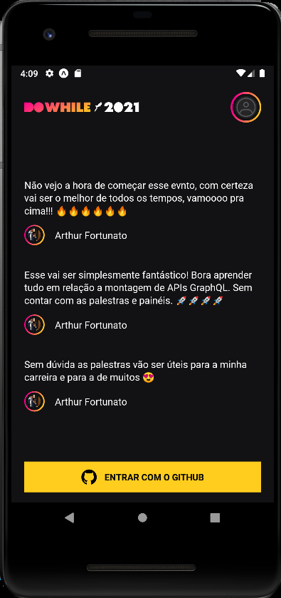

<h1 align="center"> 🚀🚀 NLW - Heat 🚀🚀</h1>
<h2 align="center">Trilha Impulse</h2>
<br>

<p align="center">
  
</p>

## 💻 Projeto NLW Heat Impulse 
<br>

<p align="center">
  
</p>

## 🧪 Tecnologias

Esse projeto foi feito com as seguintes tecnologias:

- [ReactJS](https://reactjs.org)
- [TypeScript](https://www.typescriptlang.org/)
- [NodeJS](https://nodejs.org/en/)
- [Express](https://expressjs.com/)
- [Prisma](https://www.prisma.io/)
- [Socket.io](https://socket.io/)
- [ReactNative](https://reactnative.dev/)
- [Expo](https://docs.expo.dev/)
- [Moti](https://moti.fyi/)
- [Axios](https://www.npmjs.com/package/axios)

<p align="center">
  
</p>

---

```bash

# Clone o repositório
$ git clone https://github.com/arthurfortunato/NLW_HEAT.git

# Acesse a pasta do backend do projeto no prompt de comando
$ cd backend

# Instale as dependências
$ yarn

# Execute o script "start"
$ yarn dev

# O projeto inciará na porta: 4000 

# Acesse a pasta do frontend ou mobile do projeto no prompt de comando
$ cd front-react || cd mobile-reactnative

# Instale as dependências 
$ yarn

# Execute o script "start"
$ web: yarn dev
$ mobile: expo start
